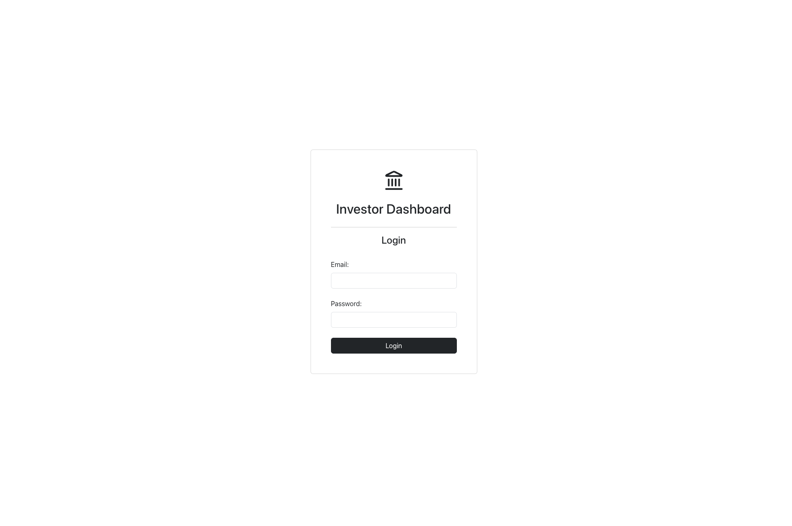
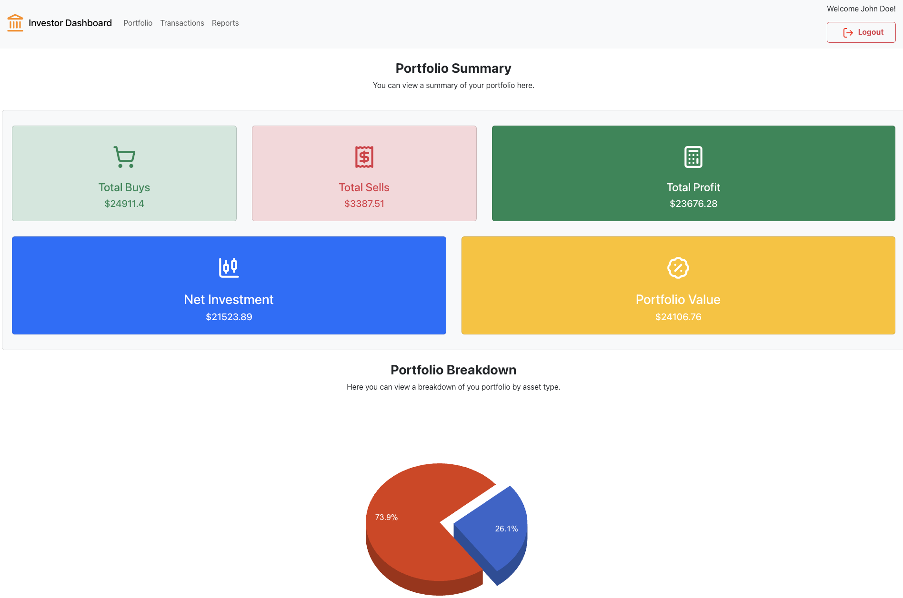
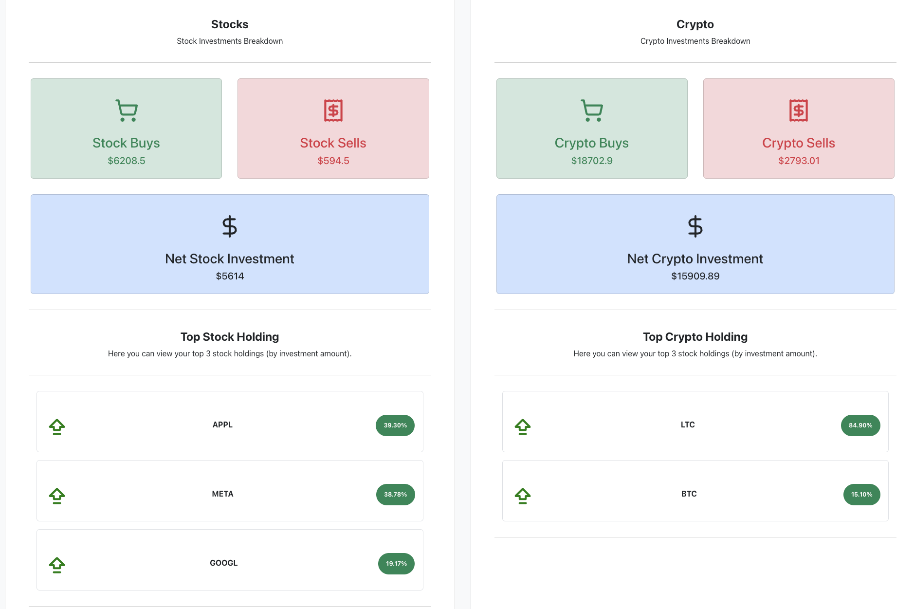
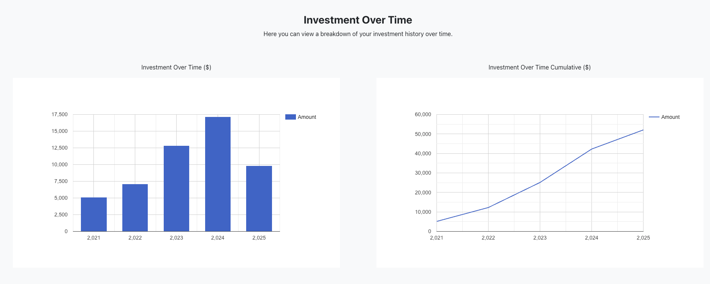
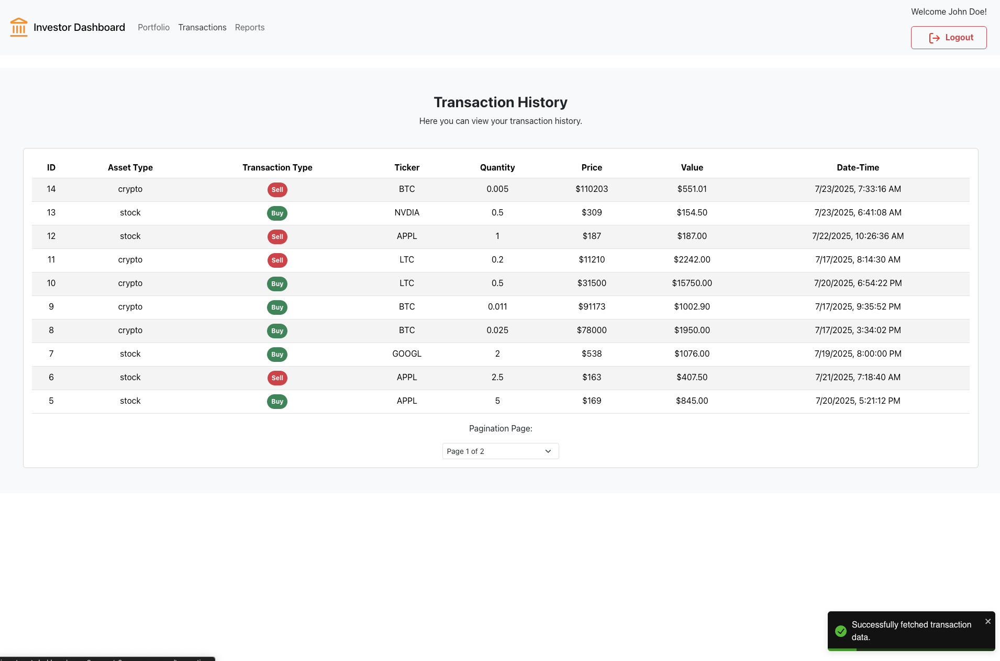
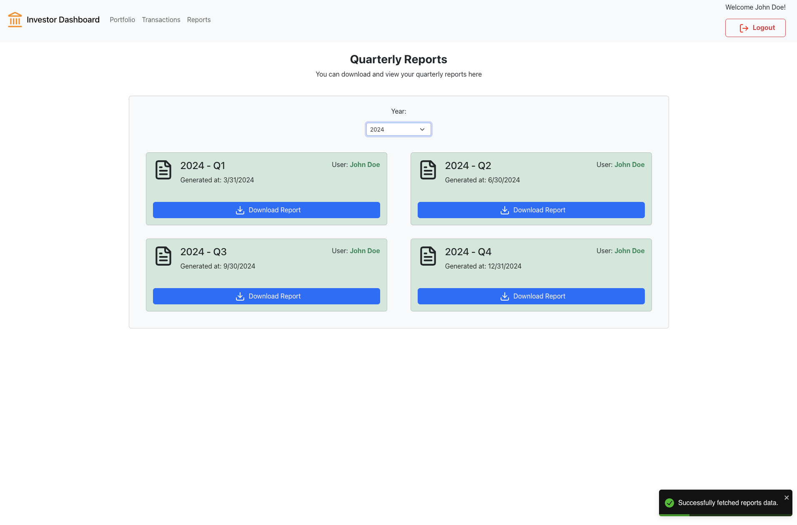

# Live Link (Frontend App)
- App (Frontend): http://investment-dashboard-app.s3.us-east-2.amazonaws.com/index.html

# API Liveness Link
- To confirm backend API is live and healthy, simply use the publicly accessible health endpoint: /health -> http://3.129.251.86:3000/api/v1/health

# Public Github Repo
- https://github.com/mateenah95/investor_dashboard/

# Screenshots

## Login Page

## Portfolio Page
f

## Transactions Page

## Reports Page

# How to use/run the app (public/production)
- To use the app, simply use the public App (frotend) link listed in the "Live Links" section above. 

- To use the platform you must login with a valid account. Account details for a registered user can be found below which can be used to login.

* email: jondoe@gmail.com
* password: password123

# How to use/run the app (local/development)
- Clone the public github repo listed above which holds the frontend and backend code in their respective folders
- To run the backend, ensure you have Node js installed on your machine. If it is not already installed, install it. Then cd into the backend folder and run the `npm install` command to install the node package requirements for the API. Once installed, simply run the API server using `node app.js`.
- To run the frontend locally, ensure you have Node js installed on your machine. If it is not already installed, install it first. Then cd into the frontend folder and run the `npm install` command to install the node package requirements for the frontend app. Once installed, simply run the frontend app using `npm run dev`. 

- To use the platform you must login with a valid account. Account details for a registered user can be found below which can be used to login.

* email: jondoe@gmail.com
* password: password123

# Stack Used

- Backend 
  * Javascript (language)
  * Node js (JS Runtime)
  * Express js (API Server)
  * Sequelize (ORM)
  * Sqlite (Local File Based Database)

- Frontend
  * Javascript (language)
  * React (frontend framework)
  * HTML, CSS, JS

- Infrastructure/Tools
  * aws ec2 (backend api deployment)
  * aws s3 (frontend hosting and report files hosting)
  * git, github
  * PM2 - process manager 

# High Level Components
- Frontend layer: SPA written in React
- Backend layer: REST API written in JS running in a Node js environment on a AWS linux server
- Data layer:
  * A local SQLite file on the linux server
  * AWS S3 buckets to save and host and serve user's quarterly reports 

# App Objectives:
- View portfolio performance
- Track recent changes
- Download quarterly reports

#  Business Assumptions: 
- It was assumed that the platform and investor are only using stocks and crypto in their portfolio (due to lack of detailed industry knowledge about financial instruments).
- The dashboard is oriented towards the value of the investment rather than the current market value of the portfolio as the latter required live asset rates from an external API. Most of the data depends on transactions stored in the transactions table and some data (e.g. portfolio investment over time) is mocked.
- For the reports page/functionality, it was assumed that the PDF reports were to be mocked - i.e. the user can still see all the available reports by year, and download any of the PDFs for the available reports - however, the PDF itself will not contain an actual report, it will just contain the year and quarter the report is for. Mock reports were pre-uploaded to S3 buckets from where they will be hosted and served for viewing/downloading.
- For the purposes of the project, the investment/portfolio page was built around trnsactions. 

# Frontend Breakdown
- The frontend app was built in React (HTML, CSS, JS) as per requirements. 

- For frontend routing, React Router libraty due to strong integration with React, ease of use and community support.

- For frontend state management, React's built in context API was used due to small nature of the product; did not justify the overhead to use Redux. 

- Bootstrap was mainly used for styling, layout, containers and other ready to use frontend components.

- Lucide React was used for icons library - due to good integration with React, Vue and other frameworks.

- React Google Charts library was used for charting - due to easy to read docs and usage interface.

- React Toastify was used for notification library - to show success and error message toasts to the user. 

- The frontend was compiled down from JSX to regular HTML, CSS and JS using `npm run build` and the output was deployed on public AWS S3 bucket.

- The app has 4 total pages:
  * The login page
  * The portfolio page: /portfolio
  * The transactions page: /transactions
  * The reports page: /reports

- The login page simply allows a user to login if he/she has a valid account on the platform.

- The portfolio page simply shows a summary of the user's investment portfolio. 

- The transactions page - shows the users investment instrument purchase or sale transactions.

- The reports page - shows the user's quarterly reports. (Mock reports)

# Backend Breakdown

- The backend API was built in Javascript

- Node js was used as the Javascript runtime environment

- Express js was used to build the backend API framework

- Data was stored in a local SQLite file

- Sequelize was used as an ORM for handling migraitons and querying

- The backend API is used to serve the data for the frontend app. It provides an interface to the data via a RESTful API. The endpoints available on the API are:

  * /health (GET Endpoint / Non Protected) -> This unprotected endpoint serves as a liveness and readiness check for the API server
  * /auth (POST Endpoint / Non Protected) -> This unprotected endpoint allows registered users to authenticate. If successfully authenticated, they are issued with a JWT token to be used to authenticate subsequent protected API endpoint. The JWT token is valid only for a certain period (30 mins default) - configurable in the API configs.
  * /portfolio (GET Endpoint / Protected) --> This protected endpoint is used to return the data for the user's investmet portfolio. Some data is mocked.
  * /transactions (GET Endpoint / Protected) --> This protected endpoint is used to return the data for the user's transaction history.
  * /reports (GET Endpoint / Protected) --> This protected endpoint is used to return a user's quarterly reports data and links.

- All user passwords were encrypted before saving and bcypt js library was used to compare the plaintext password to the encrypted password

- To protect API routes, an authentication middleware was used which extracted the JWT authentication token from the incoming HTTP request headers, validated it and extracted the user information from it. If no authentication token, invalid token or expired token are passed, the user is revoked access to the protected routes with a 401 error response.

# Infrastructure Breakdown
- The frontend was compiled down to plain HTML, CSS and JS and able to be hosted on a public AWS S3 bucket - thus due to ease of deployment, this was used to host the frontend. The bucket had to be made publicly accessible for this to work - which was done via a quick policy change and checkbox in the bucket settings.

- The backend API was deployed on a linux server on AWS. Chose a server with minimal specs to stay within the AWS free tier. An elastic IP address was attached to the EC2 instance to make the public IP for the instance static to prevent changing on restarts. 
